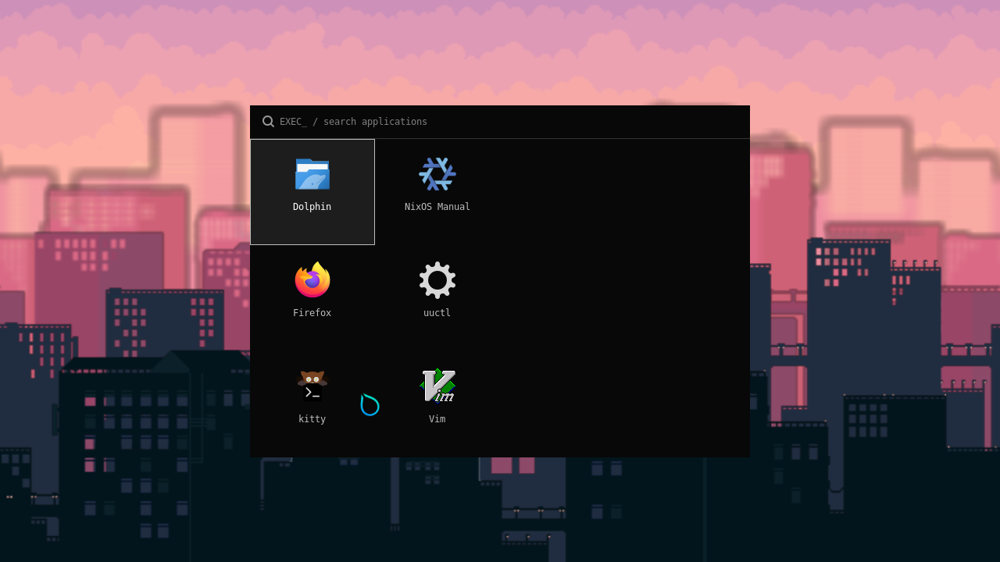
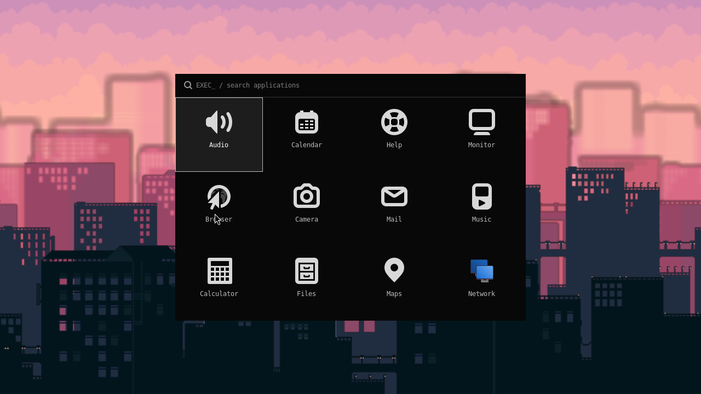
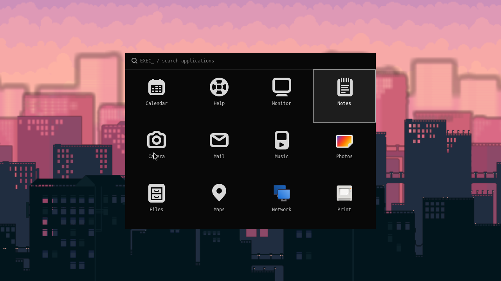
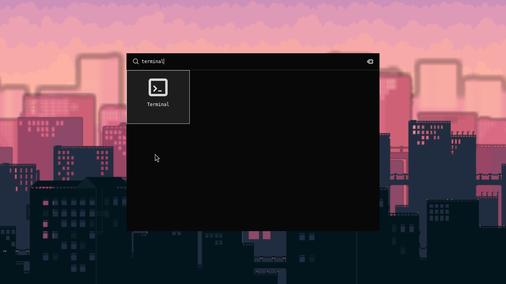

# Desktop validation

The desktop targets Hyprland **0.56.2**, hyprlax **2.2.7**, and Wofi **1.5.3**.
The launcher is Wofi with a small opt-in `horizontal_grid` patch, retaining its
upstream desktop-entry discovery, search, and execution. Four columns of three
icons are visible; additional columns scroll horizontally.

## Visual proofs

The built NixOS VM booted from a fresh disk, autologged into Hyprland/UWSM, and
started all six wallpaper layers. QEMU keyboard events opened Wofi with Super+R,
searched for Kitty, and launched its Wayland window with Enter. Hyprland's
configuration-error list contained no nonempty errors. [VM results](proofs/vm-results.json).



The base system has six desktop entries, so two columns are occupied within the
four-column viewport. The following private catalog exercises the full 4×3 view
and overflow without installing unrelated applications.

These are compositor screenshots, not mockups. The launcher screenshots use a
private 24-entry test catalog to expose overflow; they do not imply those apps
are installed by kwakOS. The wallpaper is the packaged upstream pixel-city demo.







The [input results](proofs/wofi-input-results.json) record 13 passing gates. Each
tile measured 160×136 pixels; the viewport was 640 pixels wide, with 1,280 pixels
of content. Wheel input moved horizontally from 0 to 64 pixels, smooth input
from 64 to 212.531, and touch pan from 212.531 to 640. A separate touch tap launched
the expected fixture; the pan did not launch an app.

The fixture screenshots use the **exact Nix Wofi artifact and its GTK libraries**
in an isolated Hyprland 0.56.2 session. That compositor and hyprlax were host builds
of the pinned releases; the fonts, icons, wallpaper configuration, and images
came from the Nix packages. See the [artifact manifest](proofs/manifest.json) for
source identity and SHA-256 checksums, and the [visual verdict](proofs/visual-verdict.json).

The [VM desktop](proofs/vm-desktop.png) and VM launcher image were captured by
`grim` **inside the built guest**, with every component coming from the NixOS
closure. The monitor was set to 1280×720 for capture.

## Verification results

On 2026-10-06, the VM build, `desktop-config` build check, both NixOS evaluations,
Nix formatting, Lua/Python syntax checks, C test compilation with warnings as
errors, and diff whitespace check passed. The configuration check runs the built
Hyprland release and parses the packaged TOML and all six PNG references.
The runtime input suite passed all 13 gates against the built Wofi artifact.
No physical machine was changed or deployed.

## Reproduce

Build the packages and check configuration/asset compatibility:

```sh
nix build .#hyprland .#hyprlax .#wofi
nix build .#checks.x86_64-linux.desktop-config
nix flake check --no-build
nix build .#vm
```

Run `nix run .#vm` for the NixOS desktop. Super+R opens the launcher. A fresh VM
uses the existing autologin setting; the test account is `kwak` / `nixos`.

For the automated launcher interaction checks, supply an **isolated** running
Hyprland session, never the daily desktop. The test requires a C compiler,
`pkg-config`, GTK3 development headers, `hyprctl`, and `grim`. Its environment JSON
must identify that session's private `XDG_RUNTIME_DIR`, `WAYLAND_DISPLAY`, and
`HYPRLAND_INSTANCE_SIGNATURE`, plus `PATH` and private XDG config/cache directories.
Do not publish that environment file.

```sh
python3 tests/wofi-input.py \
  --env-json /path/to/private-session-env.json \
  --wofi /path/to/patched/wofi \
  --output /tmp/kwak-wofi-proof \
  --icons /path/to/adwaita/share/icons \
  --fonts /path/to/dejavu/share/fonts
```

The test creates a private catalog of harmless desktop entries and verifies that
launching the Terminal fixture writes only its expected marker. Keyboard input
travels through Hyprland's `send_shortcut` dispatcher. A test-only preload library
records GTK geometry and delivers synthetic scroll/touch events to real GTK
handlers. It does not replace Wofi callbacks or force scroll adjustments.

Synthetic touch and smooth-scroll tests verify application handling. They do not
certify a particular physical touchscreen or trackpad. Device-specific gesture
recognition, physical-machine boot, and GPU compatibility require hardware UAT.

## Packaging decisions

- Hyprland's [v0.56.2 release](https://github.com/hyprwm/Hyprland/tree/v0.56.2)
  is pinned at `efb50993780079460b0cbed1363e2166a2de1d9f`. Its own dependency
  pins and corresponding portal stay together. The root NixOS pin is preserved.
- The release's Nix lock provides Glaze 8 while its CMake configuration requires
  `7...<8`. `packages/hyprland.nix` supplies the release's declared fallback,
  Glaze 7.2.0, through a fixed-output fetch. Hyprland's source is unchanged.
- The upstream [pixel-city demo](https://github.com/sandwichfarm/hyprlax/tree/v2.2.7/examples/pixel-city)
  has `blur = 0.0VV` in its TOML. Packaging removes only `VV`. All other settings
  and the six images remain unchanged. The legacy `.conf` is not used because
  hyprlax 2.2.7 exits with a migration notice for it. Upstream's `CI=1` build mode
  selects generic CPU flags rather than `-march=native`, so the package is portable
  across x86_64 hosts and the VM.
- Wofi's upstream orientation setting alone does not provide this layout. The
  patch keeps search above the grid, makes the GTK flow box fill three rows,
  fixes tile widths to one quarter of the viewport, enables horizontal kinetic
  scrolling, maps wheel events, and preserves widths during height allocation.
  PageUp/PageDown navigate four columns. Dark symbolic icons use a light foreground.
