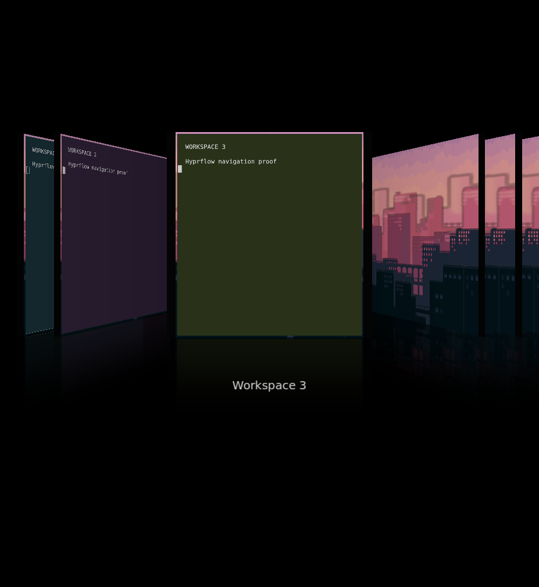

# Hyprflow workspace navigation

[Hyprflow](https://github.com/sandwichfarm/hyprflow) is loaded automatically by
the system Hyprland configuration. Press **Super+Tab** to open its workspace
overview. While open:

- **Left / Right** changes the selection.
- **1–9** jumps to that workspace's card.
- **Enter** activates the selection.
- **Escape** returns to the original workspace.
- **Super+Tab** toggles the overview closed.

The basic configuration provides nine numeric cards and includes existing
workspaces on the focused monitor. Selection remains separate from activation.
The modal submap consumes unrelated keys until the overview closes.

## Configuration and packaging

Edit `config/hypr/hyprflow.lua` to change the bindings or `workspace_count`.
Nix assembles it with `config/hypr/hyprland.lua` into the system default at
`/etc/xdg/hypr/hyprland.lua`, substituting the immutable plugin path. A user's own
`~/.config/hypr/hyprland.lua` still takes precedence.

The source is pinned to `2607d5de36902f8d770679bb40d72fa4a240c85c`. The plugin is
built with the exact Hyprland package's compiler, headers, and dependencies.
The Makefile's Lua selection is overridden to match this compositor's Lua 5.5.
No upstream C++ changes or prebuilt plugin binaries are used.

This integration targets the pinned Hyprland 0.56.2 OpenGL renderer. A compositor
update requires rebuilding and repeating runtime verification; plugins have no
stable binary ABI. Configuration parsing alone cannot prove load compatibility.

```sh
nix build .#hyprflow .#vm .#checks.x86_64-linux.desktop-config
nix flake check --no-build
nix run .#vm
```

## Verification

The source build and upstream motion tests passed, including 12,001 geometry
samples. In the built NixOS VM, 17 QEMU keyboard actions verified automatic
loading, Super+Tab, arrows, numeric selection, Enter, Escape, input isolation,
focus restoration, configuration reload, and three unload/reload cycles while
open. The compositor stayed alive with no configuration errors.



[Accepted workspace](proofs/hyprflow/accepted.png),
[runtime results](proofs/hyprflow/runtime.json), and
[artifact identity/checksums](proofs/hyprflow/manifest.json).

To reproduce the input checks, launch the disposable `kwakos-vm` with a QMP Unix
socket and a shared directory. Use a fresh output directory for each run. On the
host, start the keyboard bridge:

```sh
python3 tests/hyprflow-keys.py --qmp /path/to/qmp.sock \
  --shared-output /path/to/shared/hyprflow-proof
```

Inside the guest, export that session's `HYPRLAND_INSTANCE_SIGNATURE` and
`WAYLAND_DISPLAY`, close other windows, and run:

```sh
python3 tests/hyprflow.py --output /tmp/shared/hyprflow-proof \
  --grim /path/to/grim --plugin /nix/store/…-hyprflow-…/lib/hyprflow.so
```

The bridge checks the VM name and sends keyboard events to QEMU only. The guest
harness refuses other hosts and closes only its own fixture processes. The tests
exercise actual bindings, not direct calls to the plugin's action functions.
Physical-machine deployment and other renderers were not tested.
