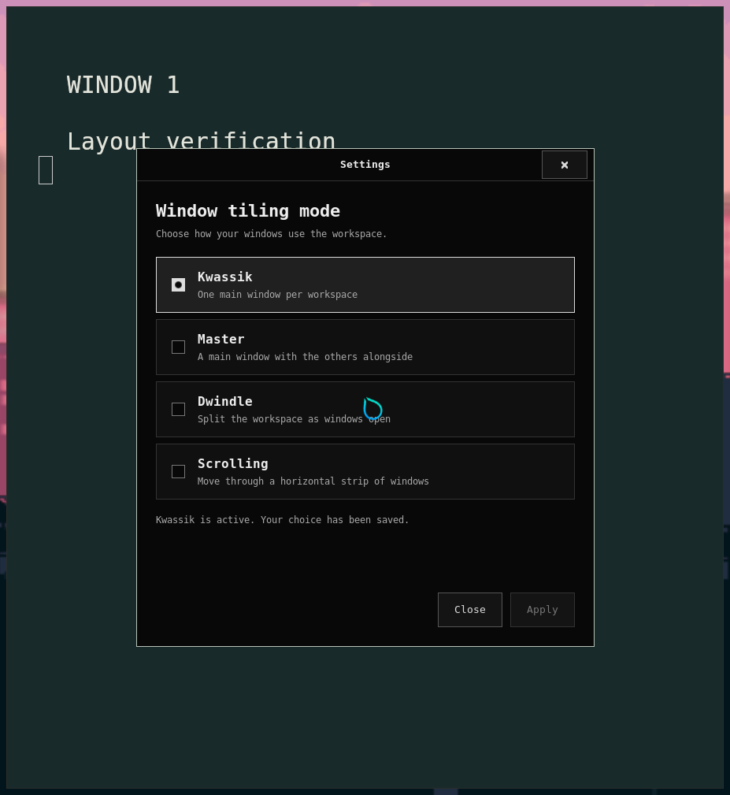

# Window tiling settings

Open **Settings** from Wofi, or press **Super+,**. Select a window tiling mode
and press **Apply**. The change takes effect immediately and is saved for later
sessions. This app has one setting.

| Mode | Behavior |
| --- | --- |
| **Kwassik** (default) | One main window per workspace, filling the available area. New windows use empty workspaces; switching into this mode separates existing tiled windows. |
| **Master** | One large main window with the remaining windows stacked alongside it. |
| **Dwindle** | Divide the workspace into tiles as windows open. |
| **Scrolling** | A horizontal strip of windows; focusing a window moves the viewport to it. Uses Hyprland 0.56.2's built-in scrolling layout. |

Switching among Master, Dwindle, and Scrolling keeps windows on their current
workspaces. It changes how windows sharing a workspace are arranged; it does
not gather windows from other workspaces. New windows stay on the active
workspace in those modes.

Super+Left/Right switches workspaces in Kwassik. In the other modes, Super+arrow
keys focus neighboring windows. Super+1…0 still switches workspaces directly.
Floating dialogs and the Settings window retain their normal floating behavior.

Before separating a workspace with multiple main windows, Kwassik requires its
other floating windows/dialogs to be closed. The app reports this before changing
anything. Hyprland's Lua interface does not expose transient-parent links, so it
cannot safely infer which window should take a dialog to another workspace.

## Visual proofs

These are captures from the built NixOS VM, using four colored terminal fixtures.
The test selected each mode through the real Settings radio controls and Apply
button. It verified the saved preference, configuration reload, compositor layout
name, and window geometry. See [runtime results](proofs/settings/runtime.json).

| Mode | Desktop proof | Settings selection |
| --- | --- | --- |
| Kwassik | [One full-area window](proofs/settings/layout-kwassik.png), with the others on [separate](proofs/settings/layout-kwassik-2.png) [workspaces](proofs/settings/layout-kwassik-3.png) | [Kwassik active](proofs/settings/settings-kwassik.png) |
| Master | [One master and three stacked windows](proofs/settings/layout-master.png) | [Master active](proofs/settings/settings-master.png) |
| Dwindle | [Four non-overlapping split windows](proofs/settings/layout-dwindle.png) | [Dwindle active](proofs/settings/settings-dwindle.png) |
| Scrolling | [First window](proofs/settings/layout-scrolling-first.png) and [last window](proofs/settings/layout-scrolling.png) in the horizontal strip | [Scrolling active](proofs/settings/settings-scrolling.png) |



A full shutdown and new VM boot retained Scrolling in both the saved preference
and the compositor's actual layout. Launching Settings through Wofi then showed
Scrolling selected. [Restart proof](proofs/settings/settings-after-reboot.png),
[artifact checksums](proofs/settings/manifest.json).

## Saved preference and errors

The per-user choice is a plain mode name in
`$XDG_CONFIG_HOME/kwak/tiling-mode`, or `~/.config/kwak/tiling-mode` when the XDG
variable is unset/empty. The app verifies the compositor accepted the change,
then saves the file atomically. A save failure attempts to restore the previous
live mode and displays the result. An invalid existing preference is preserved
and reported rather than silently replaced.

Hyprland reads the preference on startup and configuration reload, defaulting to
Kwassik for missing or invalid content. No root privileges or system rebuild
are needed to change the preference. A custom Hyprland config must include the
kwakOS controls for the app to operate; otherwise it reports that controls are
unavailable.

## Reproduce validation

```sh
nix build .#kwak-settings .#vm
nix build .#checks.x86_64-linux.settings .#checks.x86_64-linux.desktop-config
nix flake check --no-build
```

The settings check runs the controller's error/persistence tests and the real
Lua policy against a small compositor boundary double. The desktop check parses
the configuration with the pinned Hyprland binary.

For actual UI and layout checks, run this inside the disposable `kwakos-vm` with
no other windows open and the Hyprland session environment exported:

```sh
python3 tests/settings-modes.py --output /tmp/settings-proof --grim /path/to/grim
```

This test selects each mode through the GTK radio controls and Apply button,
checks the live layout, saved preference, reload behavior, and actual window
geometry, and captures screenshots. It closes only its own test windows and
leaves Scrolling saved for a separate full VM reboot check. Physical hardware
validation is not covered by the VM.
