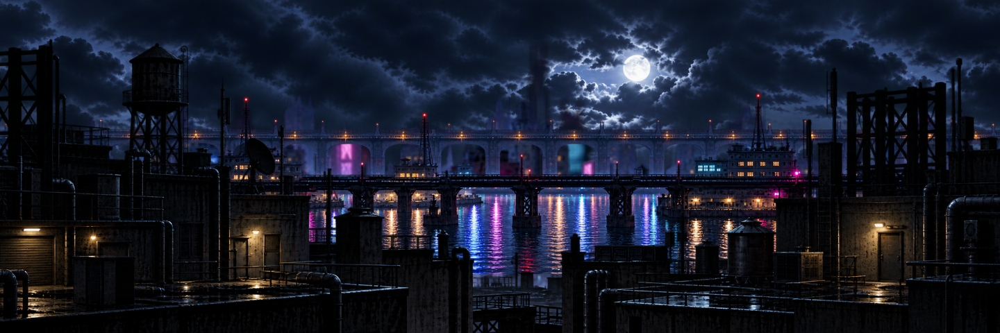
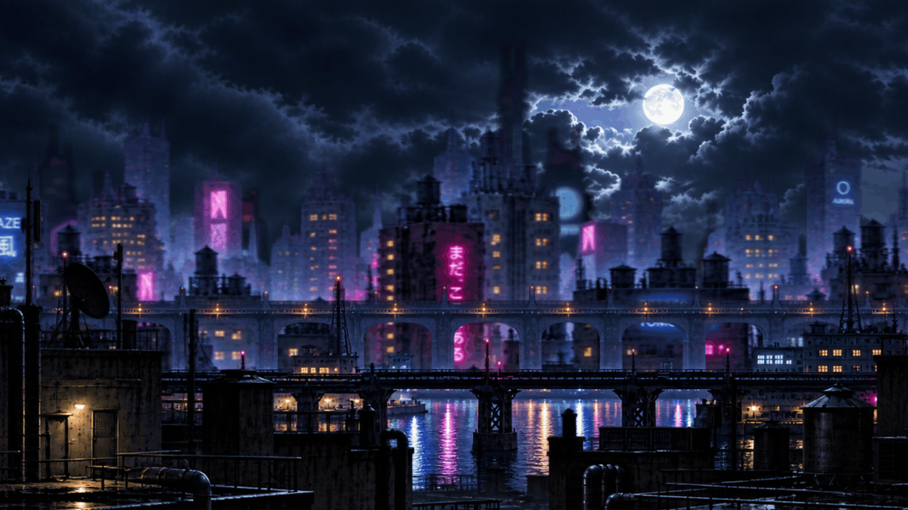

# Five-layer city wallpaper

`kwak-wallpaper` loads the checked-in configuration and five supplied images from
the Hyprlax package. No stock demo images are installed. The existing package
path, `share/hyprlax/pixel-city/parallax.toml`, keeps the launcher compatible.

| Image | Role | Shift multiplier | Draw order |
| --- | --- | ---: | ---: |
| `4.png` | Fixed sky | 0.0 | 1 (back) |
| `3.png` | Distant city | 0.3 | 2 |
| `2.png` | Middle city | 0.5 | 3 |
| `1.png` | Near city | 1.0 | 4 |
| `0.png` | Fixed camera / rooftop | 0.0 | 5 (front) |

The starting point is [Hyprlax v2.2.7's pixel-city TOML](https://github.com/sandwichfarm/hyprlax/blob/v2.2.7/examples/pixel-city/parallax.toml).
All global values are retained: workspace input, 5% shift, four-second expo
animation, 144 FPS, vsync off, content scale 1.0, and horizontal-only tiling.
All layers use full opacity. The distant and middle city retain demo blur
values of 1.1 and 0.3; the near city, rooftop, and sky use zero blur.

## Supplied artwork

Images 0, 1, 2, and 4 are byte-for-byte copies of the supplied files. Image 3 was
RGB with an opaque black background, which would hide the sky. With approval,
`tests/wallpaper-alpha.py` made its edge-connected black background transparent.
It changes only alpha: every RGB pixel is preserved. The four-connected flood
fill accepts `max(R,G,B) <= 3` to include the almost-black background pixels,
and leaves enclosed dark details opaque. It made 985,824 pixels transparent.

[Source and packaged SHA-256 hashes](proofs/wallpaper-assets.json) identify all
five inputs and the repaired output. Reproduce that repair with Pillow installed:

```sh
python3 tests/wallpaper-alpha.py /path/to/original/3.png /tmp/3.png
cmp /tmp/3.png config/hyprlax/3.png
```

## Runtime proof





The captures use unmodified Hyprlax **2.2.7** (`make CI=1`) in an isolated,
headless **Sway 1.9** session on Linux arm64 with software rendering. The source
archive's NAR hash matches the pinned package hash
`sha256-CkhHGPfYqGTPSFFzhOoIQCGi31wK7u+MYpWqeq55RJQ=`.
The loaded configuration and images come from the evaluated Nix `postInstall`
output. These are real compositor captures; this run does not certify a rebuilt
x86_64 NixOS VM, Hyprland integration, or physical GPU performance.

The capture harness forwards real Sway IPC through a local socket that compacts
JSON whitespace. Hyprlax 2.2.7's Sway adapter searches for the exact string
`"change":"focus"`, while Sway 1.9 includes spaces. The proxy changes no event
fields or values. Without it, this Sway test environment fails the movement
check. The shipped package and Hyprland configuration do not include this proxy.

`tests/wallpaper-proof.py` captures both workspace transitions, then isolates each
layer through Hyprlax's visibility IPC without changing its speed. It captures
workspaces 1 and 2 after the four-second animation settles, compares static
layers pixel-for-pixel, and measures city translation by image registration.
[Runtime settings, checksums, and measured movements](proofs/wallpaper-results.json)
record the result.

At 1440×480, images **1**, **2**, and **3** moved **72**, **36**, and approximately
**22 pixels** respectively during a one-workspace change (the distant target is
21.6 pixels). Images **0** and **4** produced byte-identical before/after PNGs.
Nix package evaluation, the evaluated asset installation step and its config
assertions, upstream global-default comparison, and source/alpha checks passed.
The full NixOS closure build and VM boot were not rerun on this macOS host.

## Reproduce

On x86_64 Linux, build the package and the full desktop configuration check:

```sh
nix build .#hyprlax
nix build .#checks.x86_64-linux.desktop-config
```

The desktop check enforces the five-image set, back-to-front order, fixed layers,
descending city speeds, valid PNG headers, and the upstream global defaults.

For an isolated capture, use Sway, grim, Pillow, and the built Hyprlax binary.
Create `/tmp/kwak-wallpaper-runtime` with mode 0700, owned by the test user.
Start Sway as that user with `XDG_RUNTIME_DIR=/tmp/kwak-wallpaper-runtime`,
`WLR_BACKENDS=headless`, `WLR_RENDERER=pixman`, and
`WLR_LIBINPUT_NO_DEVICES=1`, using this minimal config:

```text
output HEADLESS-1 mode 1440x480
seat seat0 hide_cursor 100
```

Set `SWAYSOCK` to that session's socket and `WAYLAND_DISPLAY` to its display,
and enable `LIBGL_ALWAYS_SOFTWARE=1` for the software renderer. Then run:

```sh
python3 tests/wallpaper-proof.py \
  --hyprlax /path/to/hyprlax \
  --config /path/to/share/hyprlax/pixel-city/parallax.toml \
  --output /tmp/wallpaper-proof
```

The runner requires the dedicated runtime directory and a single headless output.
It writes the full composite, individual-layer before/after captures, animation
frames with capture timestamps, the daemon log, and a JSON result. The 3:1 capture
matches the supplied artwork's aspect ratio; the retained default fit behavior
applies on other monitor shapes.
